<div align="center">

# AI Legal Assistant

**Contract risk analysis, semantic contract comparison and cited Q&A, with every finding backed by
a verbatim quote from the contract.**


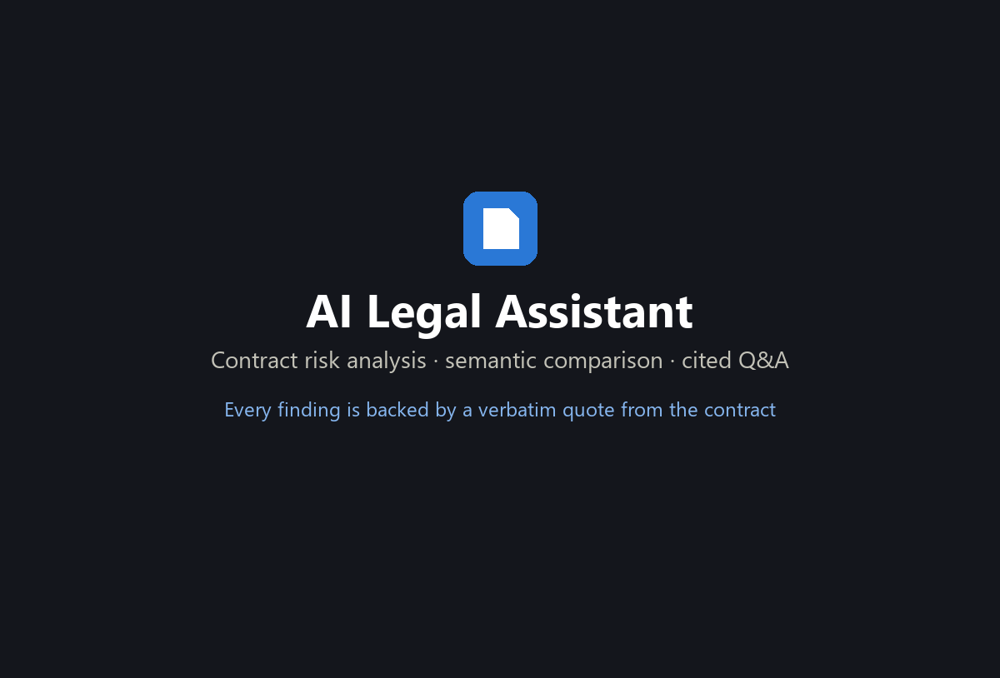

</div>

---

## What it does

Upload a contract (PDF, DOCX or TXT). The app indexes it and **automatically runs an AI risk
review** before you ask anything. You can then compare it with another version, ask questions
about it, and export reports.

| Module | What you get |
| --- | --- |
| **AI Risk Analyzer** | Checks **23 risk types** across Financial, Legal, Business, Compliance and Operational. Each finding has a severity (Critical / High / Medium / Low), clause, page, verbatim quote, explanation, reason, suggested improvement and confidence score. Gives a 0–100 risk score, charts and recommended actions |
| **Contract Comparison** | Compares **14 topics** (payment, notice period, liability, termination, IP, SLA and more) by meaning, not text diff. Each is classified **Added / Removed / Modified / Unchanged** with values A → B (e.g. *60 days → 90 days*), plus business impact, an executive summary and the change in risk score |
| **Side-by-side viewer** | Two documents that scroll together, **aligned clause by clause**, with highlighted changes, a change navigator and jump-to-clause |
| **AI Chat** | Grounded Q&A over one or more contracts. Numbered citations open the contract at the quoted text. Conversation history is saved |
| **Dashboard and analytics** | Portfolio risk score, critical risks, risk distribution, trends, most frequent risks, recent uploads and searches |
| **Export** | Risk reports and comparisons as **Markdown** or **PDF** (DOCX planned) |

## Screenshots

| | |
| --- | --- |
| 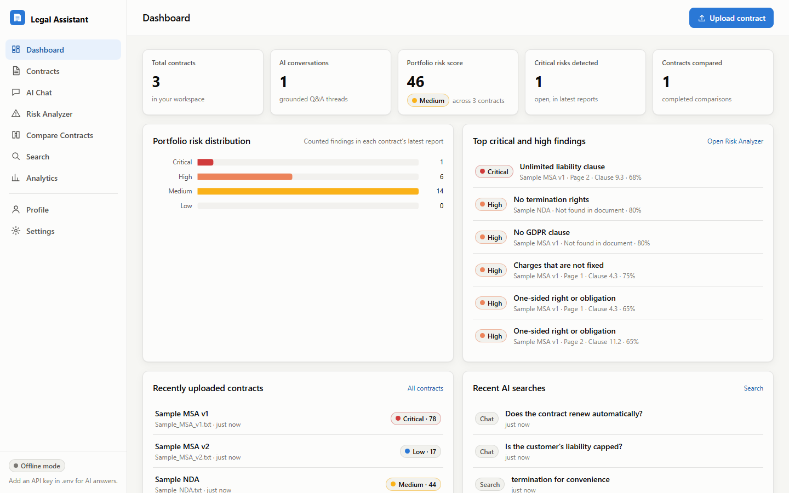 **Dashboard** | 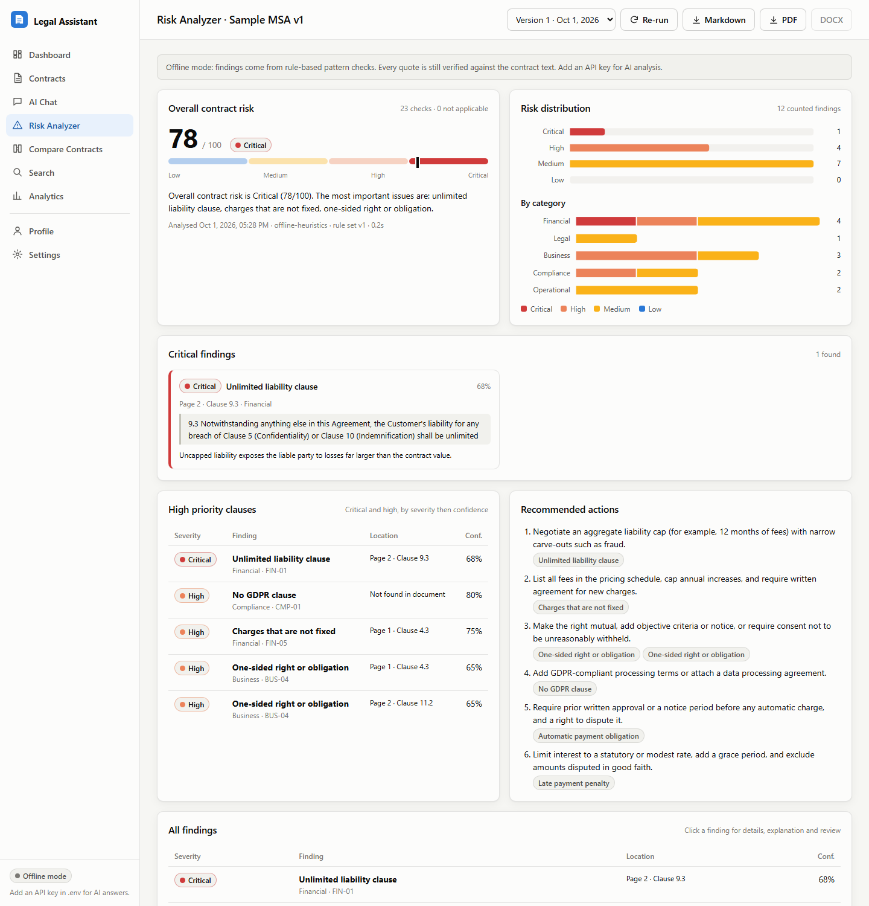 **Risk Analyzer** |
| 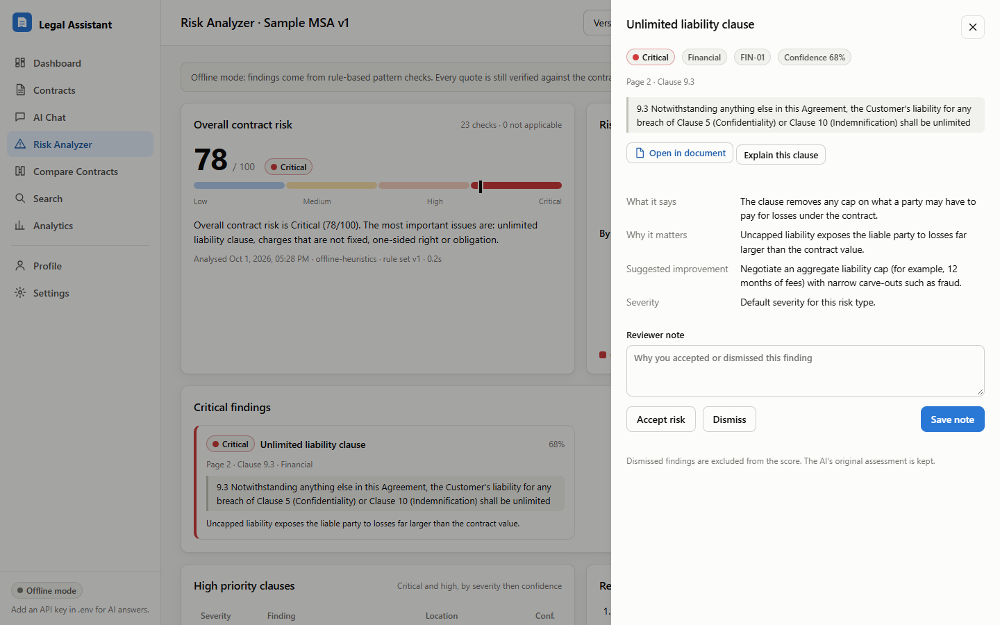 **Finding detail and reviewer actions** | 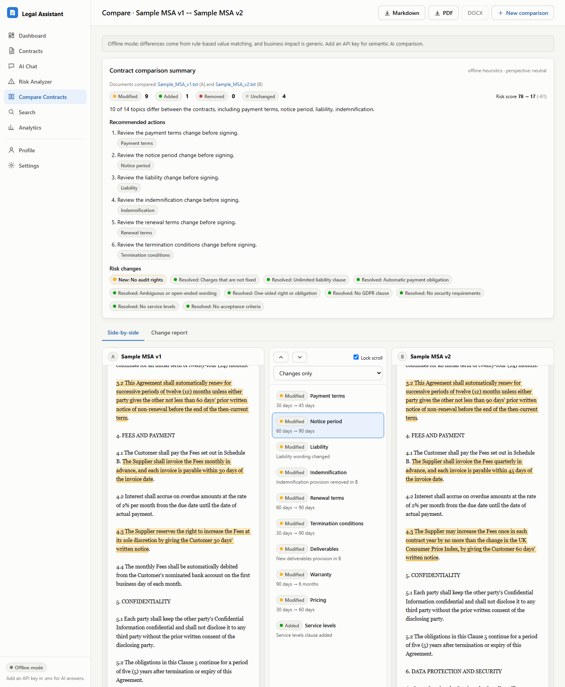 **Side-by-side comparison** |
| 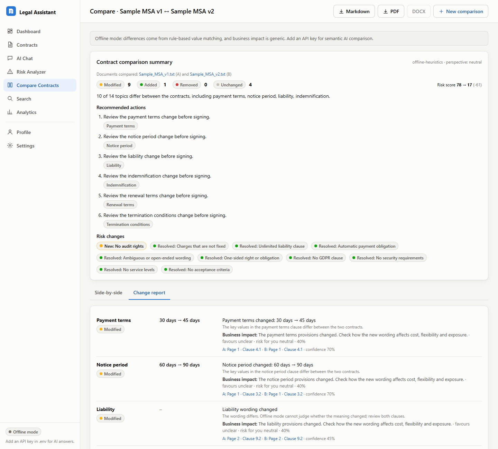 **Change report with business impact** | 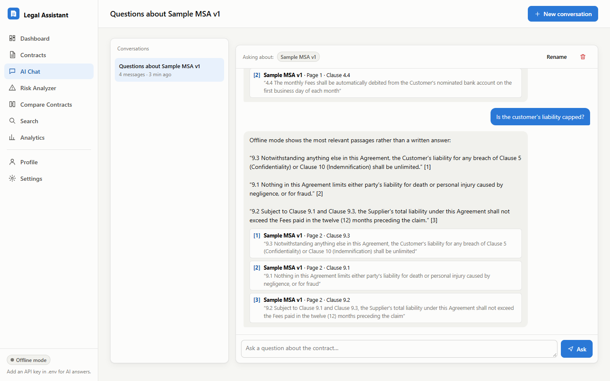 **AI Chat with citations** |
| 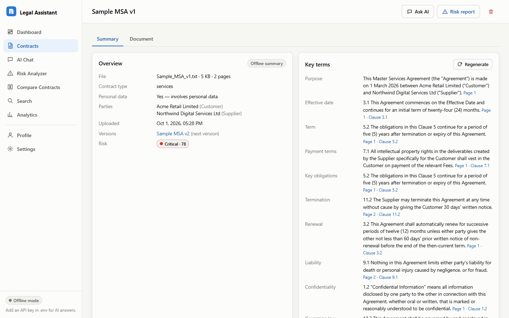 **Contract summary** | 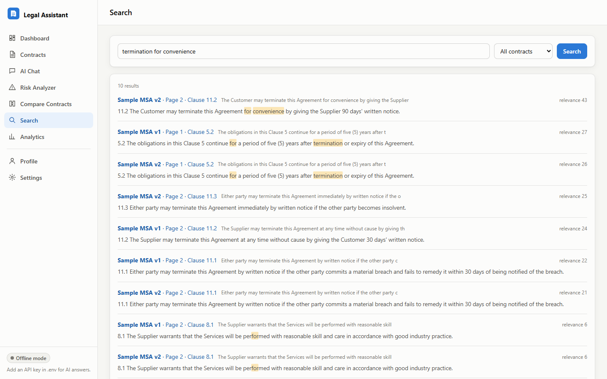 **Clause search** |
| 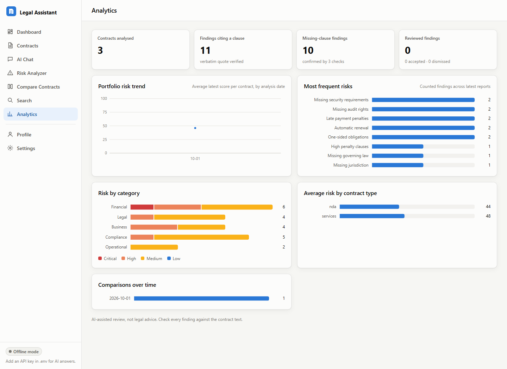 **Analytics** | 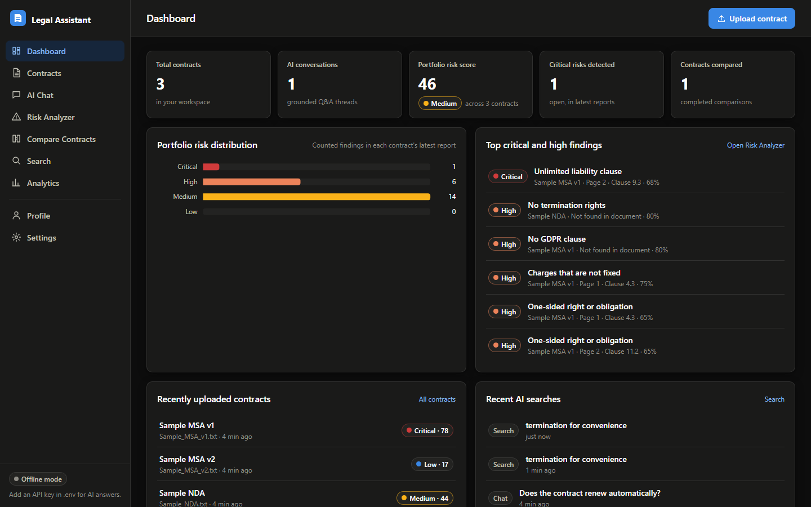 **Dark mode** |

## The core idea: the AI never invents a risk

LLMs can make up clauses. This project treats that as the main thing to engineer against:

1. **Evidence comes from retrieval, not the model.** The model only sees retrieved excerpts and
   must return a `chunk_id` plus a **verbatim quote**.
2. **Every output is verified before it is stored** ([`verifier.py`](backend/services/verifier.py)):
   - Quotes that aren't literally in the cited chunk are **dropped**.
   - Citations to chunks that weren't provided are **dropped**.
   - Sentences stating numbers that aren't in the evidence are **removed**.
   - Severity can move at most one level from the taxonomy default.
3. **Page and clause numbers come from document metadata**, never from the model.
4. **A missing-clause finding needs three signals to agree:** a keyword scan, a retrieval check
   and the model. Its confidence is capped at 85%.
5. **Scores are calculated, not generated** ([`scoring.py`](backend/services/scoring.py)):
   `score = 100 × (1 − Π(1 − wᵢ))`, which gives diminishing returns. For example, 1 Critical,
   1 Medium and 1 Low give **40 (Medium)**.
6. **Recommendations must reference real finding ids**, or they are dropped.
7. **Contract text is treated as untrusted.** Prompts tell the model to ignore instructions
   embedded in a contract.

## Architecture

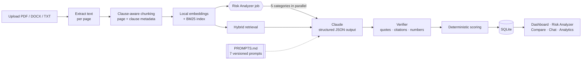

- **Backend:** Python, FastAPI, SQLite. All AI calls go through
  [`ai_service.py`](backend/services/ai_service.py): `generate_answer`, `summarize_contract`,
  `explain_clause`, `risk_analyzer`, `compare_contracts`, `generate_executive_summary`.
- **Prompts:** all 7 prompt templates live in [`PROMPTS.md`](PROMPTS.md) (question answering,
  summarisation, risk analysis, clause explanation, comparison, executive summary, business
  impact). They're parsed at startup and versioned, and none are hard-coded in route handlers.
- **LLM:** Anthropic Claude (`claude-opus-5-5` by default) with JSON-schema structured outputs
  and server-side refusal fallback.
- **Retrieval:** local hashed n-gram embeddings plus BM25, with no network calls and no model
  download. The embedder can be swapped for a neural one.
- **Frontend:** a single-page app in plain ES modules (no build step), hand-built SVG charts,
  light and dark themes, responsive down to 375px. All contract text is escaped.

## Quick start

**Requirements:** Python 3.11+ (Windows, macOS or Linux).

```bash
git clone https://github.com/Kushc168/AI-Legal-Assistant.git
cd AI-Legal-Assistant
python -m venv .venv
# Windows:
.venv\Scripts\activate
# macOS / Linux:
source .venv/bin/activate
pip install -r requirements.txt
cp .env.example .env        # on Windows: copy .env.example .env
uvicorn backend.main:app --host 127.0.0.1 --port 8000
```

On Windows you can also just run `.\run.ps1`.

Open **http://127.0.0.1:8000** and click **Load sample contracts**. The samples are fictitious:
two versions of a services agreement and an NDA.

### Offline mode vs. AI mode

The app works **without an API key**. In offline mode the same pipelines run on deterministic
rules, and the same verifier still applies.

| | Offline (default) | AI mode |
| --- | --- | --- |
| Enable | nothing to set | `ANTHROPIC_API_KEY=...` in `.env`, then restart |
| Risk findings | regex patterns per risk type | Claude reviews retrieved clauses per category |
| Comparison | key-value diff (days, %, amounts, frequency) | semantic comparison and business impact |
| Chat | most relevant passages, quoted | written answer with numbered citations |

Other settings in `.env`:
- `LLM_MODEL`: the Claude model to use.
- `LLM_BASE_URL`: a private gateway URL.
- `LLM_FALLBACKS=off`: turn this on if your gateway rejects beta parameters.

## How to use it

1. **Contracts:** drag in a file. Indexing and the risk review start automatically. Mark an
   upload as a *new version* of an earlier contract to get one-click comparison.
2. **Risk Analyzer:** review the score, critical findings, high-priority clauses and recommended
   actions. Click a finding to see the quote, open it in the document, get a plain-language
   explanation, and **Accept** or **Dismiss** it (the score updates straight away).
3. **Compare Contracts:** pick A and B and choose who you represent. Then read the summary,
   step through changes in the side-by-side viewer (J / K keys), or open the change report.
4. **AI Chat:** ask *"Is liability capped?"*. Each answer links to the exact clause.
5. **Export:** download any report or comparison as Markdown or PDF.

## Project structure

```
backend/
  main.py                FastAPI app: /api routes + serves the frontend
  config/                risk_taxonomy.json (23 risk types) · risk_config.json · comparison_categories.json
  prompts/loader.py      parses PROMPTS.md into a versioned prompt registry
  routes/                HTTP handlers only (contracts, risk, chat, compare, workspace)
  services/
    ai_service.py        all AI features
    llm_client.py        Claude client: structured outputs, retries, refusals
    verifier.py          quote / citation / number-grounding checks
    scoring.py           deterministic risk scoring
    ingest.py            PDF/DOCX/TXT extraction and clause-aware chunking
    embeddings.py        local lexical embeddings
    retrieval.py         hybrid cosine + BM25 search
    heuristics.py        offline-mode implementations
    export.py            Markdown + PDF reports
    analytics.py         dashboard and analytics queries
frontend/                index.html · css/app.css · js/ (router, pages, charts, document viewer)
samples/                 fictitious sample contracts
tests/                   pytest suite (offline + fake-LLM pipelines)
docs/                    screenshots and demo
SPEC.md                  functional specification
BUILD_PLAN.md            sprint plan (Sprints 6–10) and status
PROMPTS.md               all LLM prompt templates
```

## Tests

```bash
python -m pytest
```

There are **33 tests**, covering:
- the prompt registry: every prompt renders and its schemas are API-compatible;
- the verifier, scoring and clause chunking;
- an end-to-end offline pipeline: upload, analysis, chat, comparison and export;
- a **fake-Claude pipeline** that checks fabricated quotes, citations, numbers and
  recommendations are stripped before storage.

## API overview

| Method | Endpoint | Purpose |
| --- | --- | --- |
| `POST` | `/api/contracts` | Upload a contract (multipart) |
| `GET` | `/api/contracts/{id}/risk-report` | Latest risk report |
| `POST` | `/api/contracts/{id}/risk-analysis` | Re-run the analysis |
| `PATCH` | `/api/risk-findings/{id}` | Accept / dismiss a finding, with a note |
| `POST` | `/api/comparisons` | Compare two contracts |
| `GET` | `/api/comparisons/{id}/export?format=md\|pdf` | Export a comparison |
| `POST` | `/api/conversations/{id}/messages` | Ask a question |
| `GET` | `/api/dashboard` · `/api/analytics` · `/api/search` | Dashboard, analytics, search |

Interactive API docs are at **http://127.0.0.1:8000/docs**.

## Roadmap

- [x] AI Q&A with a citation engine and conversation history (Sprint 6)
- [x] AI Risk Analyzer, risk dashboard, scoring and reports (Sprint 7)
- [x] Contract comparison, side-by-side viewer, business impact and export (Sprint 8)
- [x] Analytics and responsive design (Sprint 9, partial)
- [ ] Multi-user auth and per-contract permissions
- [ ] OCR for scanned PDFs
- [ ] DOCX export
- [ ] Neural embeddings option and a labelled evaluation set
- [ ] Docker image and deployment guide

## Disclaimer

This is AI-assisted contract review, **not legal advice**. Always check findings against the
source contract. The sample contracts are fictitious.

## Author

**Kush Chandak** · [@Kushc168](https://github.com/Kushc168)
